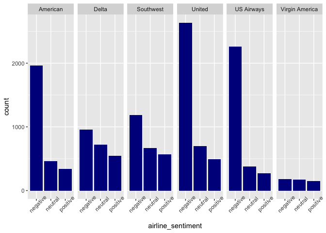
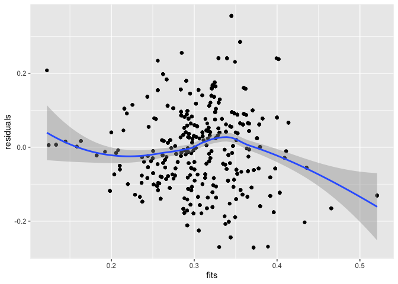

## d

``` r
data <- read.csv("https://raw.githubusercontent.com/zjbranson/315Fall2022/master/hw1DataTypes.csv")
```

``` r
library(tidyverse)
```

    ## ── Attaching packages ─────────────────────────────────────── tidyverse 1.3.2 ──
    ## ✔ ggplot2 3.4.0     ✔ purrr   0.3.5
    ## ✔ tibble  3.1.8     ✔ dplyr   1.1.0
    ## ✔ tidyr   1.2.1     ✔ stringr 1.4.1
    ## ✔ readr   2.1.3     ✔ forcats 0.5.2
    ## ── Conflicts ────────────────────────────────────────── tidyverse_conflicts() ──
    ## ✖ dplyr::filter() masks stats::filter()
    ## ✖ dplyr::lag()    masks stats::lag()

``` r
ggplot(data = data, aes(x = age, y = income)) + 
  geom_point(aes(color = factor(opinion))) +
  scale_color_discrete(name = "Opinion", labels = c("disagree", "not sure", "agree"))
```


``` r
music = read.csv("https://raw.githubusercontent.com/zjbranson/315Fall2022/main/bransonMusicData.csv")
```

``` r
freqTable = table(music$genre)
getPropCI = function(freqTable, alpha = 0.05){
  #the total sample size is
  n = sum(freqTable)
  #the proportions are
  proportions = freqTable / n
  #the standard error for proportions is
  SE = sqrt((proportions * (1 - proportions)) / n)
  #the confidence intervals are
  CI.lower = proportions - (qnorm(1-(alpha / 2)) * SE)
  CI.upper = proportions + (qnorm(1 - (alpha / 2)) * SE)
  #then, putting together the lower and upper bounds...
  #(you just need to uncomment this code)
  CIs = rbind(CI.lower, CI.upper)
  return(CIs)
}
 music.CIs.bonferroni = data.frame(
  genre = names(freqTable),
  counts = as.vector(freqTable),
  lower = as.vector(getPropCI(freqTable, alpha = (0.05 / 21))[1,] * sum(freqTable)),
  upper = as.vector(getPropCI(freqTable, alpha = (0.05 / 21))[2,]) * sum(freqTable))

ggplot(data = music.CIs.bonferroni, aes(genre, counts)) + geom_col(fill = "pink") +
 geom_errorbar(aes(ymin=lower, ymax=upper)) + 
 labs(
 title = "Number of Songs by Genre",
 x = "Genre",
 y = "Number of Songs"
 )
```


``` r
music$isItPunk = ifelse(music$genre == "punk", "Yes", "No")
ggplot(data = music, aes(x = day)) + 
  geom_bar(aes(fill = isItPunk)) +
  labs(
 title = "Number of Songs that were Punk by Day",
 x = "Day",
 y = "Number of Songs"
 )
```


``` r
songs = read.csv("https://raw.githubusercontent.com/zjbranson/315Fall2022/master/1000songs.csv")
songs$YEAR = as.numeric(gsub(",","",songs$YEAR))
songs$decade = ifelse( songs$YEAR <= 1959, "1910s-50s",
ifelse( songs$YEAR <= 1969, "1960s",
    ifelse( songs$YEAR <= 1979, "1970s",
        ifelse(songs$YEAR <= 1989, "1980s",
            ifelse(songs$YEAR <= 1999, "1990s", "2000s")))) )
songs$decade = as.factor(songs$decade)
```

``` r
ggplot(data = songs, aes(x = YEAR, y = THEME)) + 
  geom_boxplot(aes(fill = THEME), alpha = 0.5) + 
  labs(
    title = "Marginal Distribution of Year of Songs by Theme",
    x = "Year",
    y = "Theme")
```


``` r
library(tidyverse)
ggplot(songs, aes(x=YEAR, color=THEME)) +
  geom_density()
```


``` r
ggplot(data = songs, aes(x = YEAR)) + 
  geom_histogram(aes(y = ..density..), fill = "blue", binwidth = 8) +
  geom_density(col = "darkred") +
  facet_grid(THEME ~ .) +
  labs(
    title = "Marginal distribution of Year of Song",
    x = "Year",
    y = "Density"
  )
```

    ## Warning: The dot-dot notation (`..density..`) was deprecated in ggplot2 3.4.0.
    ## ℹ Please use `after_stat(density)` instead.


``` r
ggplot(data = songs, aes(x = YEAR, y = THEME)) + 
  geom_violin() +
  geom_boxplot(alpha = 0.5, width = 0.2) + 
  labs(
    title = "Marginal Distribution of Year of Songs by Theme",
    x = "Year",
    y = "Theme")
```


``` r
mosaicplot(table(songs$decade, songs$THEME),
           col = c("red", "orange", "yellow", "green", "blue", "darkblue", "purple"))
```


``` r
mosaicplot(table(songs$decade, songs$THEME), shade = TRUE)
```


``` r
airlineTweets = read.csv("https://raw.githubusercontent.com/zjbranson/315Fall2022/main/airlineTweetData2022.csv")
```

``` r
ggplot(data = airlineTweets, aes(x = airline)) + 
  geom_bar(aes(fill = airline_sentiment), position = "dodge")
```


``` r
ggplot(data = airlineTweets, aes(x = airline_sentiment)) + 
  geom_bar(fill = "darkblue") +
  facet_grid(~ airline) +
  theme(axis.text.x = element_text(angle = 45))
```


``` r
wine <- read.csv("https://raw.githubusercontent.com/zjbranson/315Fall2022/master/wineQualityReds.csv")
library(ggridges)
wine$quality = factor(wine$quality)
ggplot(data = wine, aes(x = alcohol, y = quality, height = stat(density))) +
  geom_density_ridges(stat = "density")
```

    ## Warning: `stat(density)` was deprecated in ggplot2 3.4.0.
    ## ℹ Please use `after_stat(density)` instead.



``` r
ggplot(data = wine, aes(x = alcohol, y = quality)) + geom_density_ridges() +
  labs(title = "Density of Alcohol Concentration by Quality",
       x = "Alcohol (% by volume)",
       y = "Wine Quality")
```

    ## Picking joint bandwidth of 0.338


``` r
ggplot(data = wine, aes(x = alcohol, y = quality, height = stat(density))) +
  geom_density_ridges(stat = "binline", breaks = c(5,10,15), scale = 0.9)
```


``` r
wine$alcoholLevel = as.factor(ifelse(wine$alcohol > 10, "High", "Low"))
ggplot(data = wine, aes(x = log(sulphates), color = quality)) + 
  geom_density(aes(y=after_stat(density))) +
  facet_grid(~ alcoholLevel) +
  geom_rug()
```


``` r
electionData = read.csv("https://raw.githubusercontent.com/zjbranson/315Fall2022/main/electionData.csv")
```

``` r
ggplot(data = electionData, aes(x= hs_pct, y = poverty)) +
  geom_point() +
  geom_smooth(method = lm, se = FALSE, color = "blue") +
  geom_smooth(method = loess, se = FALSE, color = "red") +
  geom_smooth(method = lm, se = FALSE, formula = y ~ x + I(x^2), color = "green") +
  labs(
    main = "Poverty level vs high school degree percentage by municipality",
    x = "Percentage of population with high school degree",
    y = "Percentage of population whose is income below the poverty line"
  )
```

    ## `geom_smooth()` using formula = 'y ~ x'
    ## `geom_smooth()` using formula = 'y ~ x'


``` r
linReg = lm(poverty ~ hs_pct, data = electionData)
fits = fitted(linReg)
residuals = residuals(linReg)
ggplot(data.frame(fits = fits, residuals = residuals), aes(x=fits,y=residuals)) +
  geom_point() +
  geom_smooth(method = loess)
```

    ## `geom_smooth()` using formula = 'y ~ x'


``` r
#ensure female and africanAmerican are factors
electionData$female = factor(electionData$female)
electionData$africanAmerican = factor(electionData$africanAmerican)

# #plot1 code
plot1 = ggplot(electionData,
    aes(x = unemp, y = voter_turnout)) +
geom_point(aes(color = africanAmerican, shape = female)) +
geom_smooth(method = lm, se = FALSE) + labs(title = "Plot 1")
# #plot2 code
plot2 = ggplot(electionData,
    aes(x = unemp, y = voter_turnout, color = africanAmerican)) +
geom_point(aes(shape = female)) +
geom_smooth(method = lm, se = FALSE) + labs(title = "Plot 2")
# #plot3 code
plot3 = ggplot(electionData,
    aes(x = unemp, y = voter_turnout, shape = female)) +
geom_point(aes(color = africanAmerican)) +
geom_smooth(method = lm, se = FALSE) + labs(title = "Plot 3")
# #plot4 code
plot4 = ggplot(electionData,
    aes(x = unemp, y = voter_turnout, shape = female, color = africanAmerican)) +
geom_point() +
geom_smooth(method = lm, se = FALSE) + labs(title = "Plot 4")
# 
library(gridExtra)
```

    ## 
    ## Attaching package: 'gridExtra'

    ## The following object is masked from 'package:dplyr':
    ## 
    ##     combine

``` r
# #arrange the plot
grid.arrange(plot1, plot2, plot3, plot4)
```

    ## `geom_smooth()` using formula = 'y ~ x'

    ## `geom_smooth()` using formula = 'y ~ x'
    ## `geom_smooth()` using formula = 'y ~ x'
    ## `geom_smooth()` using formula = 'y ~ x'



``` r
olive = read.csv("https://raw.githubusercontent.com/zjbranson/315Fall2022/main/olive.csv")
```

``` r
ggplot(data = olive, aes(x = palmitoleic, y = oleic)) +
  geom_point(aes(color = area)) +
  geom_density2d()
```


``` r
ggplot(data = olive, aes(x = palmitoleic, y = oleic)) +
  stat_density2d(aes(fill = ..density..), geom = "tile", contour = F) +
  geom_point() +
  scale_fill_gradient2(low = "white", mid = "blue", high = "red", midpoint = 6e-6)
```


``` r
spotify = read.csv("https://raw.githubusercontent.com/zjbranson/315Fall2022/main/spotify.csv")
```

``` r
spotify.subset = spotify[, 1:11]
spotify.subset = apply(spotify.subset, MARGIN = 2, FUN = function(x) x/sd(x))
spotify.subset.dist = dist(spotify.subset)

hc_single <- hclust(spotify.subset.dist, method = "single")
hc.single.dend = as.dendrogram(hc_single)

hc_complete <- hclust(spotify.subset.dist, method = "complete")
hc.complete.dend = as.dendrogram(hc_complete)

library(dendextend)
```

    ## 
    ## ---------------------
    ## Welcome to dendextend version 1.17.1
    ## Type citation('dendextend') for how to cite the package.
    ## 
    ## Type browseVignettes(package = 'dendextend') for the package vignette.
    ## The github page is: https://github.com/talgalili/dendextend/
    ## 
    ## Suggestions and bug-reports can be submitted at: https://github.com/talgalili/dendextend/issues
    ## You may ask questions at stackoverflow, use the r and dendextend tags: 
    ##   https://stackoverflow.com/questions/tagged/dendextend
    ## 
    ##  To suppress this message use:  suppressPackageStartupMessages(library(dendextend))
    ## ---------------------

    ## 
    ## Attaching package: 'dendextend'

    ## The following object is masked from 'package:stats':
    ## 
    ##     cutree

``` r
par(mfrow = c(1,2))
hc.single.dend = set(hc.single.dend, "branches_k_color", k=3)
plot(hc.single.dend, main = "Single Linkage")
hc.complete.dend = set(hc.complete.dend, "branches_k_color", k=3)
plot(hc.complete.dend, main = "Complete Linkage")
```


``` r
airportD = read.csv("https://raw.githubusercontent.com/zjbranson/315Fall2022/main/airportD.csv")
```

``` r
library(ggmap)
```

    ## ℹ Google's Terms of Service: ]8;;https://mapsplatform.google.com<https://mapsplatform.google.com>]8;;
    ## ℹ Please cite ggmap if you use it! Use `citation("ggmap")` for details.

``` r
Germany <- c(left = -10, bottom = 40, right = 20, top = 60)
map <- get_stamenmap(Germany, zoom = 3, maptype = "toner-lite")
```

    ## ℹ Map tiles by Stamen Design, under CC BY 3.0. Data by OpenStreetMap, under ODbL.

``` r
airportD = read.csv("https://raw.githubusercontent.com/zjbranson/315Fall2022/main/airportD.csv")
airport.subset = subset(airportD, lon >= -10 & lon <= 20 & lat >= 40 & lat <= 60)
```

``` r
map <- get_stamenmap(Germany, zoom = 3, maptype = "toner-lite")
```

    ## ℹ Map tiles by Stamen Design, under CC BY 3.0. Data by OpenStreetMap, under ODbL.

``` r
ggmap(map) +
  geom_point(aes(x = lon, y = lat, color = sqrt(flights), size = sqrt(flights)), data = airport.subset) +
  scale_color_distiller(palette = "RdPu")
```


``` r
#load the rent data
acs = read.csv("https://raw.githubusercontent.com/zjbranson/315Fall2022/main/acs2015_county_data.csv")
```

``` r
state_borders <- map_data("state")
acs.subset = subset(acs, State != "Alaska" & State != "Hawaii" & State != "Puerto Rico")
acs.subset = acs[, c("State", "Unemployment", "TotalPop")]
acs.subset = as.data.frame(acs.subset)
acs.subset = acs.subset %>%
   group_by(State) %>% 
   mutate(weighted_unemp = weighted.mean(Unemployment, TotalPop))
acs.subset <- acs.subset %>%
  mutate(State = tolower(State))
state_borders <- state_borders %>%
  left_join(acs.subset, by = c("region" = "State"))
```

    ## Warning in left_join(., acs.subset, by = c(region = "State")): Each row in `x` is expected to match at most 1 row in `y`.
    ## ℹ Row 1 of `x` matches multiple rows.
    ## ℹ If multiple matches are expected, set `multiple = "all"` to silence this
    ##   warning.

``` r
ggplot(state_borders) + 
  geom_polygon(aes(x = long, y = lat, group = group, fill = weighted_unemp), color = "black") +
  scale_fill_gradient2(low = "green", mid = "yellow", high = "red", midpoint = 6) +
  coord_map("polyconic")
```


``` r
county_borders <- map_data("county")
acs.subset = subset(acs, State != "Alaska" & State != "Hawaii" & State != "Puerto Rico")
acs.subset = as.data.frame(acs.subset)
acs.subset <- acs.subset %>%
  mutate(State = tolower(State)) %>%
  mutate(County = tolower(County))
county_borders <- county_borders %>%
  left_join(acs.subset, by = c("subregion" = "County", "region" = "State"))
ggplot(county_borders) + 
  geom_polygon(aes(x = long, y = lat, group = group, fill = Unemployment), color = "black") +
  scale_fill_gradient2(low = "green", mid = "yellow", high = "red", midpoint = 10) +
  coord_map("polyconic")
```


